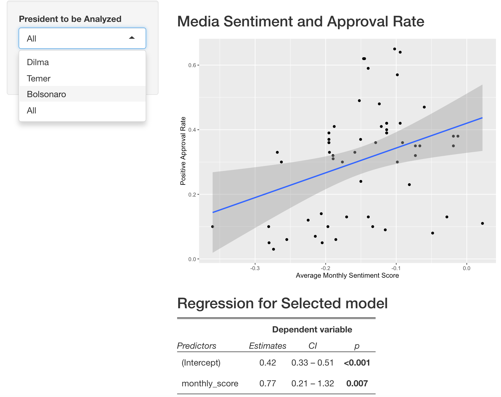

```{r setup, include=FALSE}
knitr::opts_chunk$set(echo = FALSE)
```

    
## Background
Perhaps one of the most important steps in a Data Science analysis is transforming your data into visual formats (plots) and running regressions to confirm if the correlations you see are statistically significant.

In my ShinyApp, I show in a very intuitive way how subsetting the dataset and analyzing the new correlation between $x$ and $y$ can drastically change how we interpret the relationship between both variables.

## ShinyApp Functionality
Using Shiny to show this concept is an effective approach because it allows the user to visualize both the plot and the regression table while allowing them to select criteria to subset the data and instantly notice the changes in the plot and table.



****
For instance, here is how the plot changes if I consider variable the entire data (in this case, all Presidents)

```{r, echo=F, message=F, fig.width=4, fig.height=2}
data <- readRDS("data/Approval_Sentiment_AllPresidents.rds")
names(data)[3] <- "Positive"
library(ggplot2)
ggplot(data, aes(x = monthly_score, y = Positive)) +
                geom_point() +
                ylab("Positive Approval Rate") +
                xlab("Average Monthly Media Sentiment Score") +
                geom_smooth(method = "lm")
```

and here is when I subset the dataset to consider just of its levels (in this case, just one President).

```{r, echo=F, message=F, fig.width=4, fig.height=2}
data <- readRDS("data/Approval_Sentiment_AllPresidents.rds")
names(data)[3] <- "Positive"
library(ggplot2)
ggplot(data[data$Presidente %in% "Bolsonaro",], aes(x = monthly_score, y = Positive)) +
                geom_point() +
                ylab("Positive Approval Rate") +
                xlab("Average Monthly Media Sentiment Score") +
                geom_smooth(method = "lm")
```

## Verdict
In conclusion, as it became apparent in the previous slide, when dealing with a data composed of smaller components, it is very important to take into consideration the effects of $x$ on $y$ for every level of the data.

In our example, although we spotted a (significant) positive relationship between $x$ and $y$ when looking at all Presidents, the correlation inverted when looking just at one President. This raises the question if the positive relationship is something that happens during the presidency or across presidencies---a very important difference to note when we report our findings.

And my ShinyApp allows a very good visualization of that.

